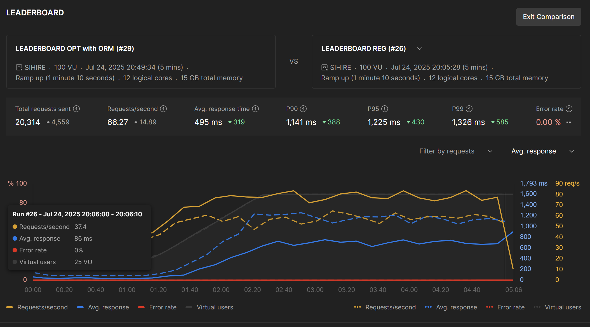

# Sparing Mingguan

## Architecture

- **Backend**: Django + PostgreSQL + Redis + WebSockets (Setup using Docker)
- **Frontend**: Next.js with TypeScript (Standard Node.js setup)

## Backend Setup

### Prerequisites

- Docker Desktop or Docker Engine

### Quick Start

1. **Clone the repository**

   ```bash
   git clone https://github.com/kyraslab/quiz_leaderboard.git
   cd quiz_leaderboard/backend
   ```

2. **Environment Configuration**

   Create a `.env` file in the backend directory. Copy the example file to get started and edit as needed.

   ```bash
   cp .env.example .env
   ```

3. **Start Backend Services**

   ```bash
   docker-compose up -d --build
   ```

   This single command will:

   - Start PostgreSQL database (port 5432)
   - Start Redis cache (port 6379) - also serves as WebSocket message broker
   - Build and start Django app (port 8000) with WebSocket support
   - Apply database migrations
   - Populate initial data automatically

4. **Verify Backend is Running**
   - API: http://localhost:8000
   - WebSocket: ws://localhost:8000/ws/leaderboard/ (can also test using `websocket_test.html`)

## Frontend Setup (Next.js)

### Prerequisites

- Node.js 18+
- npm or yarn

### Setup Instructions

1. **Navigate to frontend directory**

   ```bash
   cd quiz_leaderboard/frontend
   ```

2. **Install dependencies**

   ```bash
   npm install
   ```

3. **Environment Configuration**
   Create a `.env.local` file in the frontend directory:

   ```env
   NEXT_PUBLIC_API_URL=http://localhost:8000/api
   NEXT_PUBLIC_WS_URL=ws://localhost:8000/ws
   ```

   The WebSocket URL enables real-time features like live leaderboard updates.

4. **Start the development server**

   ```bash
   npm run dev
   ```

   The frontend will be available at http://localhost:3000

### Frontend Commands

```bash
# Development
npm run dev

# Build for production
npm run build
```

## Data Population (Automatic)

The Docker setup includes automatic data population for development:

### What Gets Populated Automatically

When `POPULATE_DATA=true` (default in development), database will be populated with 10,000 users and 20,000 quiz sessions.

### Manual Data Population

For custom data amounts:

```bash
docker-compose exec web python manage.py populate_data --clear --users 5000 --sessions 10000
```

## API Endpoints

The Django backend provides RESTful API endpoints:

- **Authentication**: `/auth/`

  - User registration, login, and logout
  - JWT token management

- **Quizzes**: `/api/quizzes/`

  - `GET /api/quizzes/` - List all quizzes
  - `GET /api/quizzes/<id>/` - Get specific quiz details

- **Quiz Sessions**: `/api/quiz-sessions/`

  - `GET/POST /api/quiz-sessions/` - List/Create quiz sessions
  - `GET /api/quiz-sessions/<id>/` - Get specific quiz session

- **Leaderboards**: `/api/leaderboard/`

  - `GET /api/leaderboard/subject/` - Subject-based leaderboard
  - `GET /api/leaderboard/quiz/<id>/` - Quiz-specific leaderboard
  - `GET /api/leaderboard/quiz/<id>/user-performance/` - Logged in user's performance for specific quiz

- **Cached Leaderboards**: `/api/cached/leaderboard/`
  - `GET /api/cached/leaderboard/subject/` - Optimized subject leaderboard
  - `GET /api/cached/leaderboard/quiz/<id>/` - Optimized quiz leaderboard
  - `GET /api/cached/leaderboard/quiz/<id>/user-performance/` - Optimized logged in user's performance

## Performance Optimization & API Versions

The system maintains two versions of leaderboard APIs for different use cases:

### Why Two API Versions?



**Note**: The legacy APIs are intentionally kept to demonstrate the performance optimization achieved through caching implementation.

**Legacy APIs** (`/api/leaderboard/`):

- **Real-time accuracy**: Always queries the database for the most current data
- **Performance**: Slower response times (~200-500ms) under high load

**Cached APIs** (`/api/cached/leaderboard/`):

- **High performance**: Uses Redis caching with optimized queries
- **Performance**: Significantly faster response times (~10-50ms) under high load
- **Cache Strategy**: Data refreshed every few minutes or triggered by specific events

## WebSocket Endpoints

Real-time communication for live leaderboard updates:

- **Leaderboard Updates**: `ws://localhost:8000/ws/leaderboard/`

  - **Authentication**: Optional JWT token via query parameter: `?token=<jwt_token>`
  - **Connection**: Automatically subscribes to general leaderboard updates

  **Message Types (Client → Server):**

  - `subscribe_quiz` - Subscribe to quiz-specific leaderboard updates
    ```json
    { "type": "subscribe_quiz", "quiz_id": 123 }
    ```
  - `unsubscribe_quiz` - Unsubscribe from quiz-specific leaderboard updates
    ```json
    { "type": "unsubscribe_quiz", "quiz_id": 123 }
    ```

  **Message Types (Server → Client):**

  - `quiz_session_uploaded` - New quiz session submitted
  - `leaderboard_updated` - General leaderboard updated
  - `quiz_leaderboard_updated` - Specific quiz leaderboard updated
  - `subscription_confirmed` - Quiz subscription confirmed
  - `unsubscription_confirmed` - Quiz unsubscription confirmed
  - `error` - Error message

## Development Workflow

### Starting Development

1. **Start Backend** (in `backend/` directory):

   ```bash
   docker-compose up -d
   ```

2. **Start Frontend** (in `frontend/` directory):

   ```bash
   npm run dev
   ```

3. **Access Applications**:
   - Frontend: http://localhost:3000
   - Backend API: http://localhost:8000
   - WebSocket endpoint: ws://localhost:8000/ws/leaderboard/
